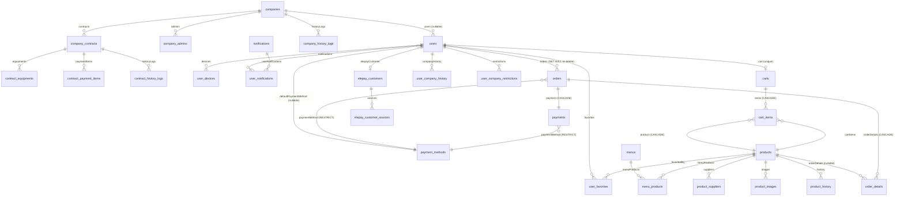

# es-kitchen-api — Entity Relationship Diagram

> Tổng hợp từ source code thực tế (`src/entities/*.entity.ts`).  
> 38 entities, PostgreSQL, TypeORM. PK là `bigint` (trả về dạng `string` trong TypeScript).

---

## Diagram tổng thể (Mermaid)

---

## Entities chi tiết

### `companies` — Công ty

| Column | Type | Ghi chú |
|---|---|---|
| `id` | bigint PK | |
| `company_code` | varchar UNIQUE | |
| `name` | varchar | |
| `name_kana` | varchar NULL | |
| `customer_postal_code` | varchar NULL | |
| `address_prefecture/city/street/building` | varchar NULL | |
| `department` | varchar NULL | |
| `customer_tel` | varchar NULL | |
| `fax` | varchar NULL | |
| `employee_count` | varchar NULL | |
| `installed_machine_count` | int DEFAULT 0 | |
| `is_cash_payment_allowed` | boolean DEFAULT false | Cho phép thanh toán tiền mặt |
| `order_limit` | varchar NULL | |
| `customer_note` | varchar NULL | |
| `status` | int DEFAULT 1 | 1=PROVISIONAL, 2=REGISTERED, 3=DELETED |
| `user_monthly_limit` | int NULL | Giới hạn đặt hàng tháng per user |
| `created_at`, `updated_at`, `deleted_at` | timestamp | Soft delete |

---

### `company_admins` — Admin của company (E02 login)

| Column | Type | Ghi chú |
|---|---|---|
| `id` | bigint PK | |
| `company_id` | bigint FK → companies (CASCADE) | |
| `name`, `name_kana` | varchar NULL | |
| `tel`, `email` | varchar NULL | |
| `hashed_refresh_token` | varchar NULL | JWT refresh |
| `role` | varchar DEFAULT 'MAIN' | MAIN \| BILLING \| SUB |
| `status` | varchar | ACTIVE \| INACTIVE |
| `last_login_at` | timestamp NULL | |
| `created_at`, `updated_at`, `deleted_at` | timestamp | Soft delete |

---

### `company_contracts` — Hợp đồng

| Column | Type | Ghi chú |
|---|---|---|
| `id` | bigint PK | |
| `company_id` | bigint FK → companies (CASCADE) | |
| `contract_plan_id`, `plan`, `menu_type` | varchar NULL | |
| `target_year_month`, `creation_type` | varchar NULL | |
| `management_name` | varchar NULL | |
| `contract_start_period`, `contract_end_period` | varchar NULL | |
| `delivery_*` (nhiều cột) | varchar NULL | Thông tin giao hàng |
| `postal_code`, `prefecture/city/street/building` | varchar NULL | Địa chỉ giao hàng |
| `tel`, `contact_name` | varchar NULL | |
| `payment_method`, `annual_payment`, `billing_notification_day` | varchar NULL | |
| `status` | varchar NULL | |
| `created_at`, `updated_at` | timestamp | |

---

### `contract_equipments` — Thiết bị trong hợp đồng

FK: `contract_id` → `company_contracts` (CASCADE)

---

### `contract_payment_items` — Hạng mục thanh toán hợp đồng

FK: `contract_id` → `company_contracts` (CASCADE)

---

### `admins` — System Admin (E03 login)

| Column | Type | Ghi chú |
|---|---|---|
| `id` | bigint PK | |
| `email` | varchar UNIQUE | |
| `password` | varchar | bcrypt |
| `hashed_refresh_token` | varchar NULL | |
| `role`, `status` | varchar/enum | |
| `created_at`, `updated_at`, `deleted_at` | timestamp | Soft delete |

---

### `users` — End users (Mobile App)

| Column | Type | Ghi chú |
|---|---|---|
| `id` | bigint PK | |
| `company_id` | bigint FK → companies NULL | NULL nếu chưa link |
| `user_code` | varchar UNIQUE | |
| `email` | varchar UNIQUE (partial idx, where deleted_at IS NULL) | |
| `user_name`, `gender`, `birthday`, `employee_id` | varchar/enum NULL | |
| `password`, `hashed_refresh_token` | varchar | bcrypt |
| `link_status` | enum | UNLINKED \| LINKED \| RESTRICTED |
| `linked_at`, `unlinked_at` | timestamp NULL | |
| `account_status` | enum DEFAULT ACTIVE | ACTIVE \| SUSPENDED |
| `unlinked_by` | bigint NULL | Company admin id |
| `cart_confirm_popup_hidden_until` | timestamp NULL | |
| `default_payment_method_id` | bigint FK → payment_methods NULL | |
| `cart_reset_ack_event_id` | bigint NULL | |
| `last_login_at` | timestamp NULL | |
| `created_at`, `updated_at`, `deleted_at` | timestamp | Soft delete |

---

### `menus` — Menu tháng

| Column | Type | Ghi chú |
|---|---|---|
| `id` | bigint PK | |
| `menu_code` | varchar(12) NULL UNIQUE (where deleted_at IS NULL) | |
| `year_month` | varchar(7) | Format: YYYY-MM |
| `menu_type` | enum | standard \| premium |
| `publish_status` | enum DEFAULT unpublished | published \| unpublished \| auto_public |
| `auto_pub_date` | timestamp NULL | Dùng khi status = auto_public |
| `pdf_url` | varchar(2048) NULL | |
| `created_at`, `updated_at`, `deleted_at` | timestamp | Soft delete |

---

### `menu_products` — Sản phẩm trong menu (junction)

| Column | Type | Ghi chú |
|---|---|---|
| `id` | bigint PK | |
| `menu_id` | bigint FK → menus (CASCADE) | |
| `product_id` | bigint FK → products (CASCADE) | |
| UNIQUE | `(menu_id, product_id)` | |
| `selling_price` | decimal(12,2) | Giá bán trong menu |
| `base_order_qty` | int DEFAULT 0 | Số lượng gợi ý |
| `std_order_qty_no_short_expiry` | int DEFAULT 0 | |
| `vending_machine_order_qty` | int DEFAULT 0 | |
| `product_tags` | simple-array NULL | ['NEW', '短賞味期限'] |
| `is_public` | boolean DEFAULT false | |
| `created_at`, `updated_at` | timestamp | |

---

### `products` — Sản phẩm (master data)

| Column | Type | Ghi chú |
|---|---|---|
| `id` | bigint PK | |
| `product_code` | varchar NULL | |
| `jan_code` | varchar UNIQUE NULL | JAN barcode |
| `category` | varchar NULL | |
| `price` | decimal(12,2) NULL | |
| `name` | varchar | |
| `name_kana`, `description` | varchar/text NULL | |
| Nutrition columns | varchar/decimal | energy, protein, fat, carbohydrate, salt_equivalent, etc. |
| `allergen_labeling` | varchar NULL | |
| `raw_material_name` | text NULL | |
| `expiration_date_value`, `expiration_date_unit` | int/varchar NULL | |
| `shipment_bundled_material`, `shipment_special_instruction` | varchar NULL | |
| `short_expiry_type` | varchar NULL | |
| `storage_method_management`, `storage_method_display` | varchar NULL | |
| `vending_machine_column`, `vending_machine_column_notes` | varchar/text NULL | |
| `supplier_website` | varchar NULL | |
| `favorite_count` | int DEFAULT 0 | Denormalized counter |
| `created_at`, `updated_at`, `deleted_at` | timestamp | Soft delete |

---

### `product_suppliers` — Nhà cung cấp sản phẩm

FK: `product_id` → `products` (CASCADE)

---

### `product_images` — Hình ảnh sản phẩm

FK: `product_id` → `products` (CASCADE)

---

### `orders` — Đơn hàng

| Column | Type | Ghi chú |
|---|---|---|
| `id` | bigint PK | |
| `order_number` | varchar(12) UNIQUE | |
| `user_id` | bigint FK → users NULL (SET NULL on delete) | |
| `company_id` | bigint NULL | Denormalized, không FK |
| `status` | enum DEFAULT PENDING | PENDING \| PAID \| CANCELLED \| REFUNDED \| etc. |
| `payment_method_id` | bigint FK → payment_methods (RESTRICT) | |
| `subtotal`, `total` | decimal(12,2) DEFAULT 0 | |
| `created_at`, `updated_at` | timestamp | |

---

### `order_details` — Chi tiết đơn hàng

| Column | Type | Ghi chú |
|---|---|---|
| `id` | bigint PK | |
| `order_id` | bigint FK → orders (CASCADE) | |
| `product_id` | bigint NULL | Không FK (snapshot) |
| `product_code`, `product_name` | varchar | Snapshot lúc đặt hàng |
| `price`, `quantity`, `subtotal` | decimal/int | |
| `created_at`, `updated_at` | timestamp | |

---

### `payments` — Thanh toán

| Column | Type | Ghi chú |
|---|---|---|
| `id` | bigint PK | |
| `order_id` | bigint FK → orders (CASCADE) UNIQUE | OneToOne |
| `payment_method_id` | bigint FK → payment_methods (RESTRICT) | |
| `status` | enum DEFAULT PENDING | PENDING \| PAID \| FAILED \| REFUNDED |
| `amount` | decimal(12,2) | |
| `transaction_id` | varchar NULL | Elepay transaction ID |
| `code_id` | varchar NULL | Elepay EasyQR code ID |
| `paid_at` | timestamp NULL | |
| `context` | varchar(50) DEFAULT CHECKOUT | CHECKOUT \| HISTORY |
| `metadata` | jsonb NULL | Raw provider response |
| `reminder_count` | int DEFAULT 0 | |
| `created_at`, `updated_at` | timestamp | |

---

### `payment_methods` — Phương thức thanh toán (master)

| Column | Type | Ghi chú |
|---|---|---|
| `id` | bigint PK | |
| `code` | varchar UNIQUE | CREDIT_CARD, CASH, ALIPAY, WECHAT, etc. |
| `name` | varchar | |
| `description` | text NULL | |
| `is_active` | boolean DEFAULT true | |
| `is_default` | boolean DEFAULT false | |
| `sort_order` | int DEFAULT 0 | |
| `image_url` | varchar NULL | |
| `created_at`, `updated_at`, `deleted_at` | timestamp | Soft delete |

---

### `carts` — Giỏ hàng (1 user = 1 cart)

| Column | Type | Ghi chú |
|---|---|---|
| `id` | bigint PK | |
| `user_id` | bigint FK → users (CASCADE) UNIQUE | |
| `created_at`, `updated_at` | timestamp | |

---

### `cart_items` — Item trong giỏ hàng

| Column | Type | Ghi chú |
|---|---|---|
| `id` | bigint PK | |
| `cart_id` | bigint FK → carts (CASCADE) | |
| `product_id` | bigint FK → products (CASCADE) | eager: true |
| UNIQUE | `(cart_id, product_id)` | |
| `quantity` | int DEFAULT 1 | |
| `created_at`, `updated_at` | timestamp | |

---

### `notifications` — Thông báo hệ thống

| Column | Type | Ghi chú |
|---|---|---|
| `id` | bigint PK | |
| `title`, `content` | varchar/text | |
| `type` | enum | MENU_PUBLISH \| ORDER_UPDATE \| etc. |
| `body` | jsonb NULL | `{ link?, preViewLink?, orderId? }` |
| `created_at` | timestamp | |

---

### `user_notifications` — Notification gửi tới user

| Column | Type | Ghi chú |
|---|---|---|
| `id` | bigint PK | |
| `notification_id` | bigint FK → notifications | |
| `user_id` | bigint FK → users | |
| INDEX | `(user_id, is_read, created_at)` | |
| `is_read` | boolean DEFAULT false | |
| `read_at` | timestamp NULL | |
| `created_at` | timestamp | |

---

### `user_favorites` — Sản phẩm yêu thích

| Column | Type | Ghi chú |
|---|---|---|
| `id` | bigint PK | |
| `user_id` | bigint FK → users (CASCADE) | |
| `product_id` | bigint FK → products (CASCADE) | |
| UNIQUE | `(user_id, product_id)` | |
| `created_at` | timestamp | |

---

### `user_devices` — FCM device tokens

| Column | Type | Ghi chú |
|---|---|---|
| `id` | bigint PK | |
| `user_id` | bigint FK → users (CASCADE) INDEX | |
| `token_device` | varchar(1024) UNIQUE | FCM token |
| `platform` | enum | IOS \| ANDROID |
| `ip`, `user_agent` | varchar NULL | |
| `last_active_at` | timestamptz NULL | |

---

### `elepay_customers` — Elepay customer mapping

| Column | Type | Ghi chú |
|---|---|---|
| `id` | bigint PK (giả định) | |
| `user_id` | bigint FK → users | |
| `elepay_customer_id` | varchar | ID từ Elepay API |
| `name` | varchar NULL | |

---

### `elepay_customer_sources` — Thẻ tín dụng lưu trong Elepay

| Column | Type | Ghi chú |
|---|---|---|
| `id` | bigint PK | |
| `elepay_customer_id` | varchar FK → elepay_customers | |
| `elepay_source_id` | varchar | ID từ Elepay API |
| `payment_method` | varchar | CREDIT_CARD |
| `status` | enum | PENDING \| ACTIVE \| INACTIVE |
| `is_default` | boolean | |

---

### Các entities phụ trợ

| Entity | Table | Mô tả |
|---|---|---|
| `Allergen` | `allergens` | Danh sách allergen, cột `sort` |
| `Category` | `categories` | Danh mục sản phẩm |
| `LegalDocument` | `legal_documents` | Terms of Service / Privacy Policy |
| `AppVersion` | `app_versions` | Thông tin phiên bản app (force/optional update) |
| `Contact` | `contacts` | Yêu cầu liên hệ từ user |
| `Otp` | `otps` | OTP tokens cho auth flows |
| `PendingUser` | `pending_users` | User đang chờ xác thực OTP đăng ký |
| `CompanyHistoryLog` | `company_history_logs` | FK → companies |
| `ContractHistoryLog` | `contract_history_logs` | FK → company_contracts |
| `ProductHistory` | `product_history` | Lịch sử thay đổi sản phẩm |
| `ProductInStock` | `product_in_stock` | Tồn kho sản phẩm |
| `UserCompanyHistory` | `user_company_history` | Lịch sử link/unlink user↔company |
| `UserCompanyRestriction` | `user_company_restrictions` | Restrict/unrestrict user by company admin |
| `CartResetEvent` | `cart_reset_events` | Sự kiện reset giỏ hàng theo admin trigger |

---

## Naming conventions

| Convention | Quy tắc |
|---|---|
| Table name | snake_case số nhiều: `users`, `company_contracts`, `order_details` |
| Column name | snake_case: `company_id`, `created_at`, `is_active` |
| PK | `id` bigint (TypeScript string) |
| FK column | `<entity>_id` — ví dụ: `company_id`, `user_id` |
| Soft delete | `deleted_at timestamptz NULL` — `@DeleteDateColumn` |
| Timestamps | `created_at`, `updated_at` — `@CreateDateColumn`, `@UpdateDateColumn` |
| Unique partial index | Dùng cho soft-delete: `WHERE deleted_at IS NULL` |

---

> Cập nhật file này sau mỗi migration. Mermaid diagram có thể render tại GitHub hoặc mermaid.live.
